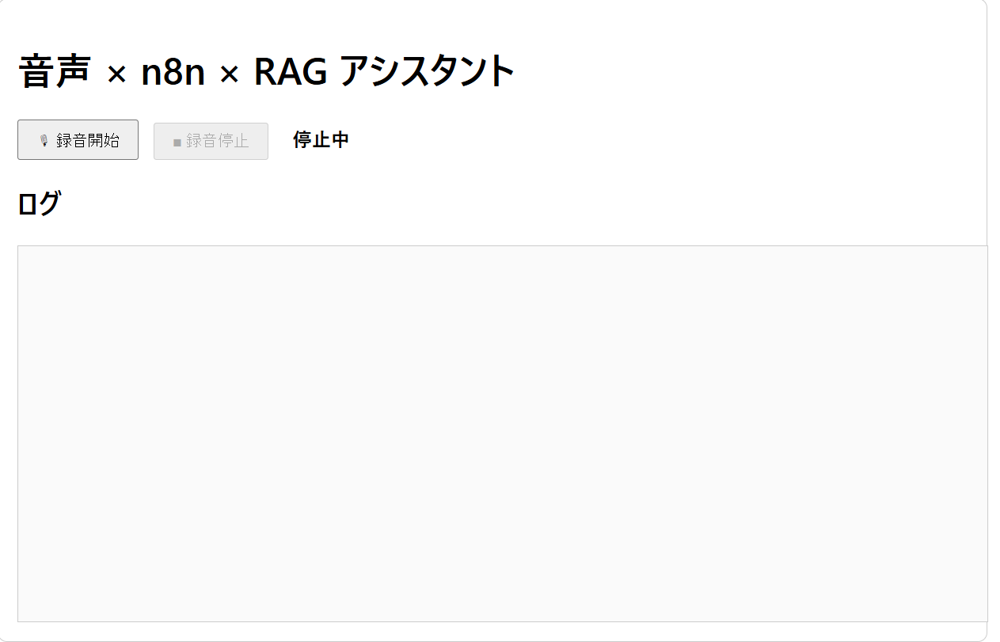
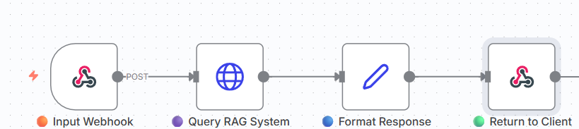
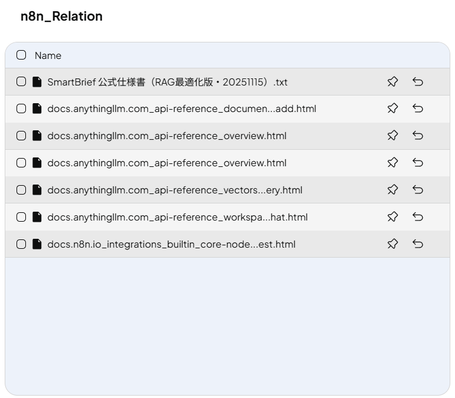

files:
  - path: README.md
    content: |
      # voice-n8n-rag-assistant
      このリポジトリは、社内ヘルプデスク・FAQ対応・ナレッジ検索AIを素早く構築するためのスターターキットです。
    
      音声入力 × n8n × RAG を連携させた対話型アシスタントのテンプレートです。  
      音声 → テキスト化 → RAG検索 → 回答生成 → Web UI までを自動化します。

      社内ヘルプデスク、FAQ対応、業務改善支援、社内ナレッジ参照AI などにそのまま展開できる構成です。

      ---

      ## 🚀 特徴

      - **音声入力（Web Speech API）** に対応  
      - **n8n ワークフロー** で自動的に LLM 問い合わせ  
      - **RAG（AnythingLLM）** により社内ナレッジを参照  
      - **Webhook レスポンスで即時回答**  
      - **テンプレート化しやすい構成**（他社導入が容易）  
      - **LINE BOT / Slack BOT へ拡張可能**（Webhook 部分を変えるだけ）

      ---

      ## 🏗 アーキテクチャ

      ```
      Web UI（音声入力）
          ↓ Webhook POST
      n8n（Webhook受信）
          ↓ HTTP Request
      AnythingLLM（RAG検索）
          ↓ 回答生成
      n8n（加工・整形）
          ↓ Webhook Response
      Web UIへ返す
      ```

      ---

      ## 📁 ディレクトリ構成

      ```
      voice-n8n-rag-assistant/
      ├─ frontend/                 # 音声収録UI・ログ表示のWebアプリ
      │   ├─ index.html
      │   ├─ style.css
      │   └─ app.js
      │
      ├─ n8n-workflow/             # n8n ワークフロー（JSON形式）
      │   └─ voice-rag-workflow.json
      │
      ├─ rag-docs/                 # AnythingLLM に取り込む社内文書
      │   ├─ sample-faq.txt
      │   └─ sample-guides.md
      │
      ├─ docs/                     # スクリーンショットや図の保存
      │   └─ images/
      │       ├─ ui.png
      │       ├─ n8n-flow.png
      │       └─ rag-sample.png
      │
      ├─ README.md                 # プロジェクト説明
      └─ LICENSE                   # MITライセンス
      ```

      ---

      ## 🖼 スクリーンショット

      ### UI  
      

      ### n8nワークフロー  
      

      ### RAGサンプル  
      

      ---

      ## 🔧 動作環境

      - Docker / Docker Compose  
      - n8n（Self-host）  
      - AnythingLLM（Self-host）  
      - Node.js（任意：Web UI 用途）

      ---

      ## 🛠 導入手順

      ### 1. n8n と AnythingLLM を起動

      ```bash
      docker compose up -d
      ```

      ### 2. n8n ワークフローをインポート  
      `n8n-workflow/voice-rag-workflow.json` を n8n に読み込む。

      ### 3. AnythingLLM にナレッジを登録  
      `rag-docs/` 内の資料を Workspace にアップロード。

      ### 4. Web UI を起動  
      `frontend/index.html` をブラウザで開くと音声対話が可能。

      ---

      ## 📦 応用・拡張アイデア

      - LINE BOT / Slack BOT 連携  
      - 社内業務マニュアル検索  
      - 問い合わせ内容の半自動化  
      - 社内 FAQ ボット  
      - 面談補助 AI  
      - オンボーディング支援 AI  

      ---

      ## 📄 ライセンス

      本リポジトリは MIT ライセンスで公開しています。
